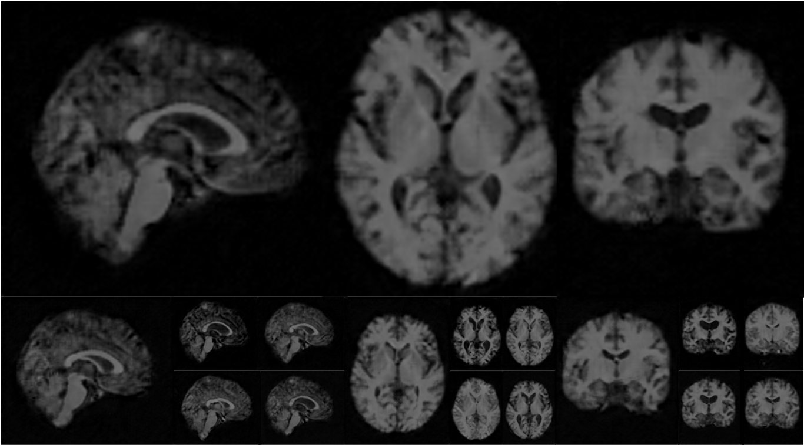
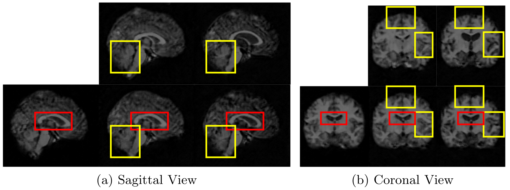

## 3D-StyleGAN for medical images

3D-StyleGAN is for the generative modeling of full 3D medical images.

Please see the official repo (https://github.com/NVlabs/stylegan2) of StyleGAN2 from NVIDIA for the original code and its license. 

## Requirements 
The requirements of the original code + 
(TF 1.14 --> TF 2.4.0), Python 3.8, nibabel

Conda environment file is included in the conda_en directory.

## Create TFRecord with 3D Medical Images (NIFTI or NPZ)

```.bash
python dataset_tool.py create_from_images3d [TFRecord_Folder/TFRecord_Name] [NIFTI Data Folder] --shuffle 1 --base_size 5 6 7
```

base_size: The size of the base layer of a generator. e.g. [ 4, 4, 4] for 2^x images; [5,6,7] for 160x192x224 (5x32, 6x32, 7x32) or 80x96x112 (5x16, 6x16, 7x16) images (shown in the paper). 

## Train 3D-StyleGAN

```.bash
python run_training.py --num-gpus=4 --data-dir=[TF_Record_Folder] --config=[Training_Config] --dataset=[TFRecord_Name] --total-kimg=6000
```

[Training_Config] needs to be filled by the name of prefixed configuration in run_training.py

The hyperparameters can be changed in run_training.py with a configuration name.

## Image Generation



```.bash
python run_generator.py generate-images --network=[Trained_Network_Path] --seeds=66,230,389,1518,1020,11,1104,1120,1031 --truncation-psi=0.0
```

## Style Mixing 



```.bash
python run_generator.py style-mixing-example --network=../trained_networks/2mm_f96.pkl --row-seeds=3181 --col-seeds=1104,1120 --truncation-psi=0.0 --col-styles=6-9
```

Please contact Sungmin Hong (HMS/MGH, shong20@mgh.harvard.edu) and Razvan Marinescu (MIT, razvan@csail.mit.edu) if you have any questions. 

